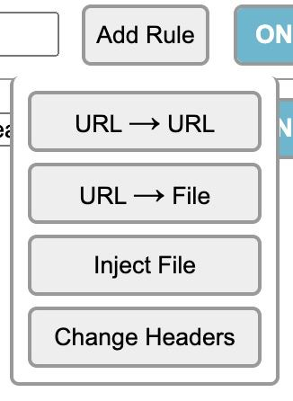
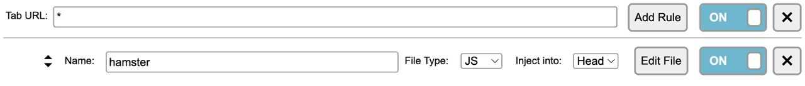
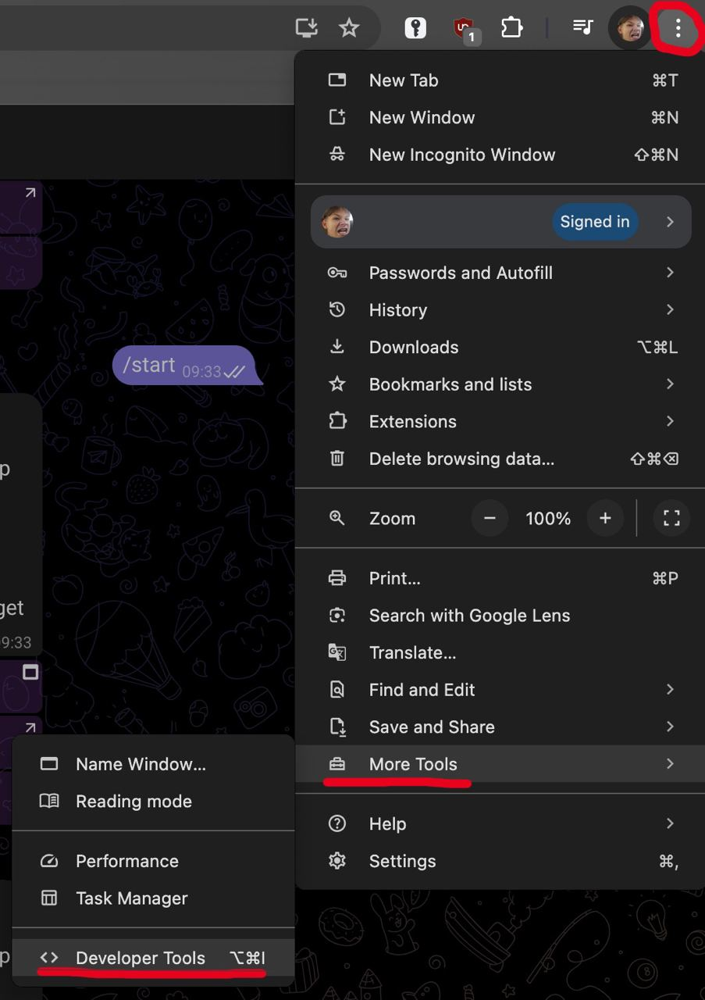
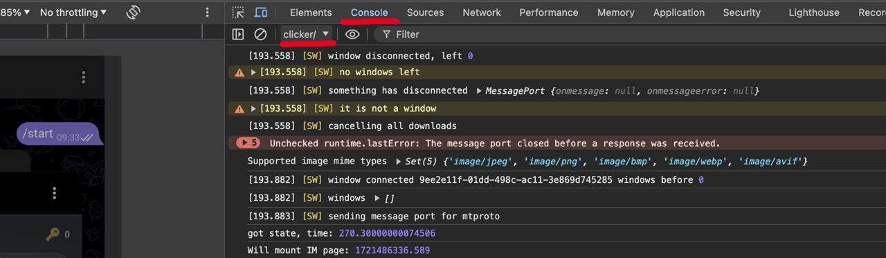

<h1>Launch HamsterKombat on Web</h1>

Many people attempted to run HamsterKombat on their PCs, but ended up physically tapping on their phones or using BlueStacks.

<h2>Start</h2>
<ol>
    <li>Download a google extension <a href="https://chrome.google.com/webstore/detail/resource-override/hldldpjjjagjfikfknjmgokjkeokkncm">"Resource Override"</a>.</li>
    <li>Open the extension, press <strong>Add Rule</strong> and choose <strong>Inject File</strong>.</li>
</ol>

<ol start="3">
    <li>Give it any name you want, for example <em>hamster</em>. Make sure that your options are <strong>JS, Head</strong>.</li>
</ol>

<ol start="4">
    <li>Pres <strong>Edit File</strong> and paste the <a href="https://github.com/AlexSeley/HamsterKombat-Web/blob/main/web_opening.js">code:</a></li>
</ol>
<pre>
    <code>
if(location.hostname === "hamsterkombatgame.io") {
    const org_indexOf = Array.prototype.indexOf
    Array.prototype.indexOf = function(...args) {
        if(JSON.stringify(this) === JSON.stringify(["android", "android_x", "ios"])) {
            setTimeout(() => {
                Array.prototype.indexOf = org_indexOf
            })
            return 0
        }
        return org_indexOf.apply(this, args)
    }
}
    </code>
</pre>

<ol start="5">
    <li>Press <strong>Save</strong>, open <a href="https://web.telegram.org/k/#@hamster_kombat_bot">HamsterKombat</a>.</li>
</ol>

<h2>AutoClicker</h2>

We can also start and AutoClicker with javascript.

<ol>
    <li>Open HamsterKombat in your browser and open <strong>Developer Tools</strong></li>
</ol>

<ol start="2">
  <li>Go to <strong>console, </strong> <strong>clicker/</strong> as your options.</li>
</ol>

<ol start="3">
  <li>Paste this <a href="https://github.com/AlexSeley/HamsterKombat-Web/blob/main/clicker.js">code:</a></li>
</ol>

<pre>
  <code>
    
button = document.querySelector('.user-tap-button')
NoneEnergy = false
function click() {
    try{
        const energy = document.querySelector('.user-tap-energy > p')
        if(energy){
            const enegryVal = energy.innerText
            const energyCur = Number(enegryVal.split("/")[0])
            const energyMax = Number(enegryVal.split("/")[1])
            
            if(!NoneEnergy){
            let i = 0
            while(i < 6){
                button.dispatchEvent(new PointerEvent('pointerup'))
                i ++
            }}

            if(energyCur <= 10){
                NoneEnergy = true
            }
            if((energyMax - energyCur) <= 20){
                NoneEnergy = false
            }
        }
    } catch(error){
        console.log(error)
    }

setTimeout(click, 123 * Math.random() + 4)
}   
click()
              
  </code>
</pre>

<h2>End</h2>

Congratulations! You have just done what a lot of people can't do. Some individuals waste a lot of energy and computer power to do the same what you did.

AutoClicker works until you get zero energy. Once your energy is charged again, Autoclicker resumes

